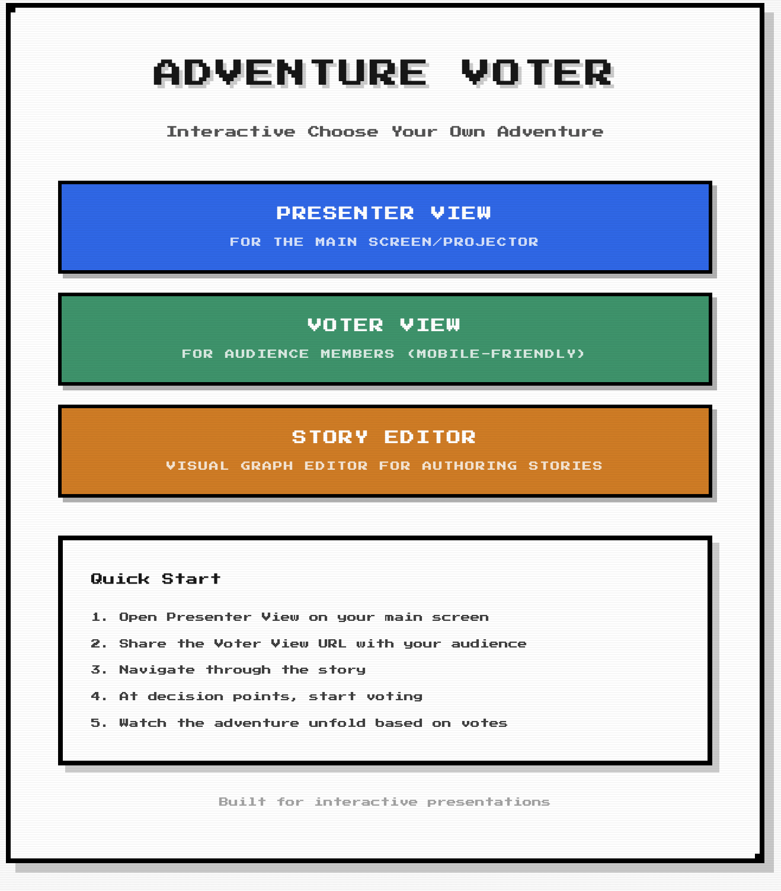
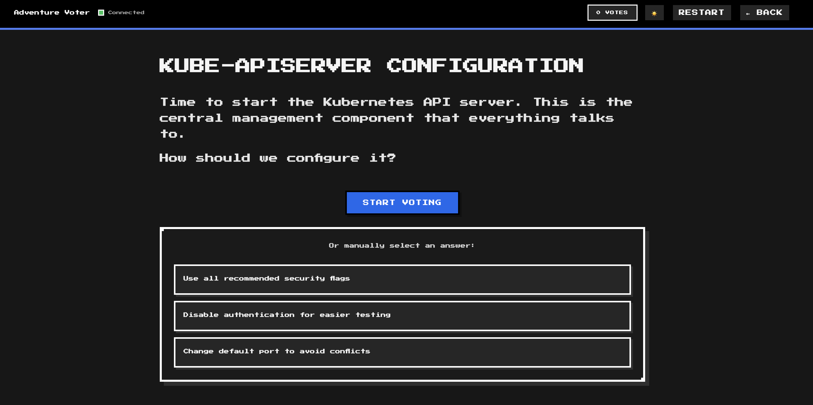
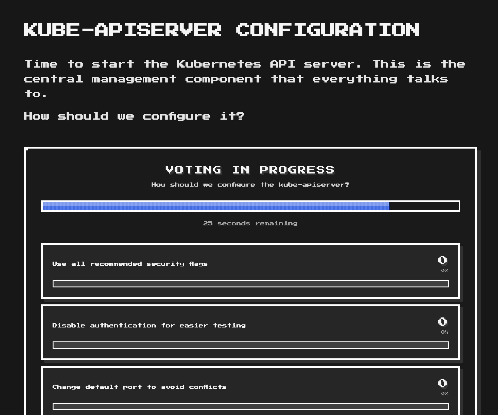
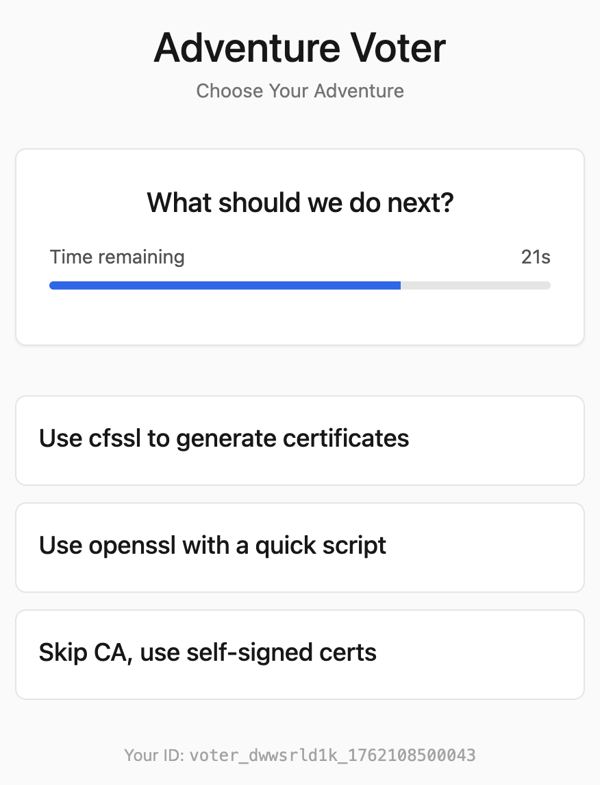
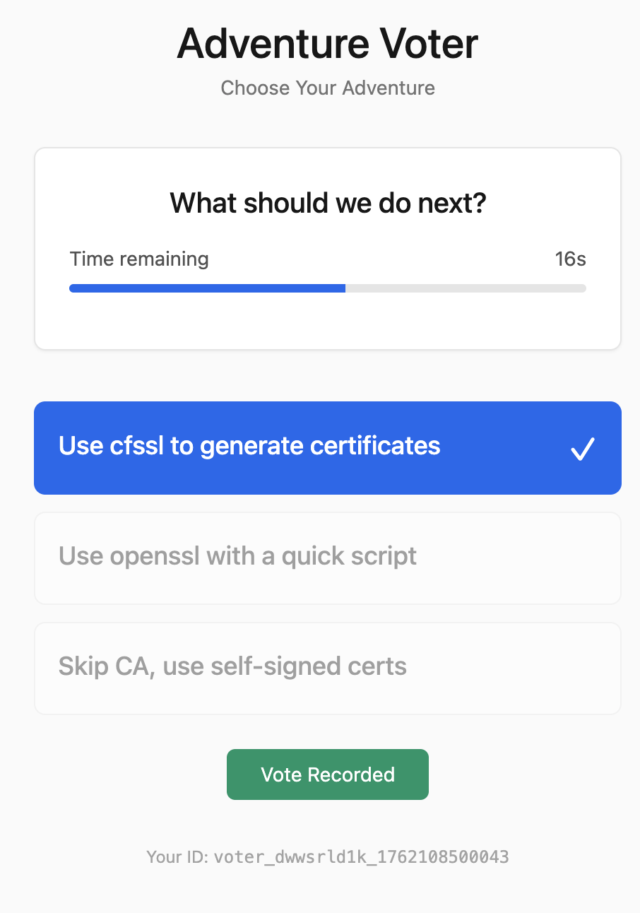
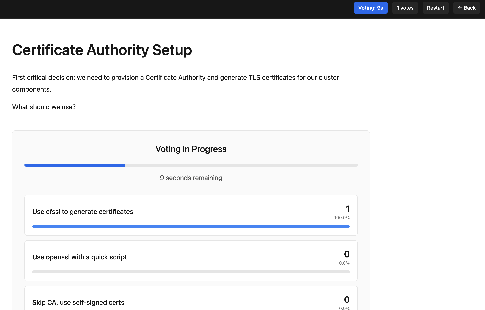
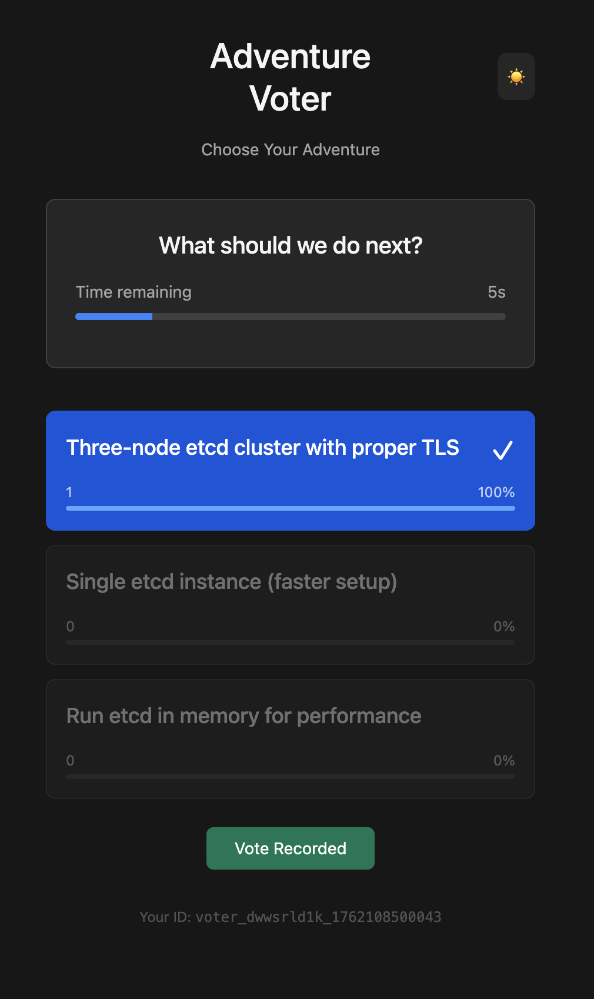
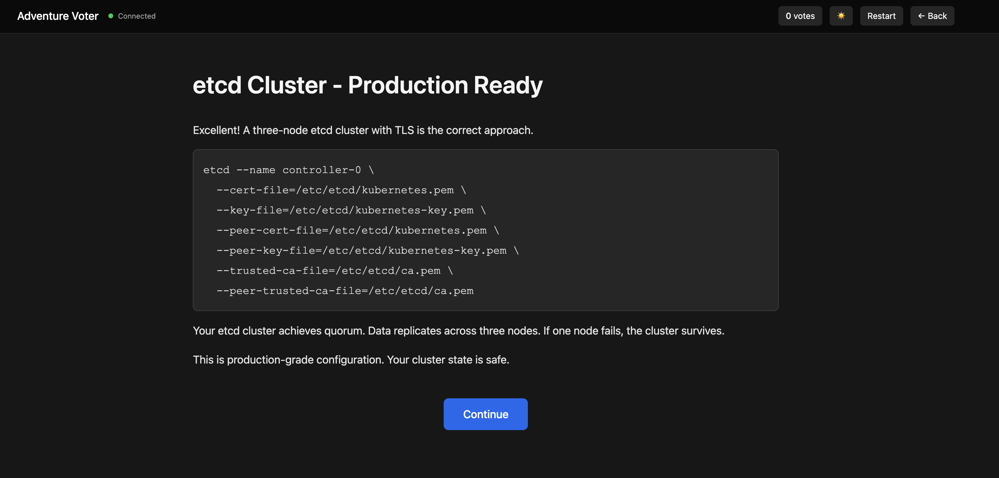

<p align="center" width="60%">
    
</p>
Hand-drawn with [Procreate](https://procreate.com/).

# Adventure Voter

An interactive presentation system where your audience votes on what happens next. Think "Choose Your Own Adventure" meets live polling for tech talks and workshops.

## What It Does

You write your presentation as markdown files with decision points. When you reach a choice, your audience votes on 
their phones, and the presentation follows the path in real-time. All communication happens over WebSockets, so votes
appear instantly.

## Showcase











## Why?

Because presentations should be _fun_! I sat through way too many boring presentations which could have a lot better
given a tiny bit of adventure. Don't get me wrong, I like a good technical presentation that shares a lot of interesting
details about the latest™ tech. But after a long day at KubeCon you don't want to sit through yet another slideshow.

This frustration and my love for TTRPGs made this... thing, happen.

## State

This is in heavy alpha. While I tested it, I'm pretty sure it's not without its faults. Especially since I'm terrible at
frontend development. The code there is pieced together from forums, books, and bits of code from various repos that do
some websocket handling. It works quite well, and I'm reasonably sure it does not farm coins...

## CSS

I used the bare minimum I could find, which is alpine.js.

## Quick Start

Using Docker:

```bash
docker-compose up --build
```

Then open http://localhost:8080/presenter for your presentation screen and share http://localhost:8080/voter with your audience.

Or build from source:

```bash
cd backend
go build -o server ./main.go
./server
```

Once done, run `docker-compose down` to shut it down.

Download from latest release:

## Writing Content

Content lives in markdown files with YAML front-matter. Here's a basic story chapter:

```markdown
---
id: intro
type: story
next: next-id
---

# Welcome to the Adventure

This is your presentation content. Use regular markdown syntax.
```

Decision points let the audience vote:

```markdown
---
id: first-choice
type: decision
timer: 60
choices:
  - id: option-a
    label: Try the risky approach
    next: risk-path
  - id: option-b
    label: Play it safe
    next: safe-path
---

# What Should We Do?

The audience will vote on the next step.
```

Start in `content/story.yaml`:

```yaml
# Adventure Voter Story Index
start: intro
```

And go from there by building up the chain through `next` sections in the markdown files.

## During Your Presentation

Open the presenter view on your screen and start sharing the voter URL. As you navigate through your story,
decision points will automatically trigger voting sessions. Results appear in real-time, and when voting closes, click continue to follow the winning path.

You can generate a QR code for the voter URL to make it easier for your audience to join.

## Architecture

The backend is a Go server handling WebSocket connections and vote aggregation. The frontend uses Alpine.js for
reactive UI without heavy frameworks. Voters connect via WebSocket to submit votes, and the presenter view shows real-time
results as they come in.

```
┌──────────────┐
│    Voters    │  WebSocket connections
│  (phones)    │
└──────┬───────┘
       │
       ↓
┌──────────────┐
│  Go Backend  │  Vote counting and state
└──────┬───────┘
       │
       ↓
┌──────────────┐
│  Presenter   │  Main display
│  (screen)    │
└──────────────┘
```

## Deployment

The server is designed to run behind a reverse proxy like Nginx or Traefik. See  for a configuration examples.

For quick deployment on a cloud server:

```bash
git clone <your-repo>
cd adventure-voter
docker-compose up -d
```

Then configure your reverse proxy to handle TLS and forward requests to port 8080.

## Configuration

The server accepts several flags:

```bash
./server \
  -addr=:8080 \
  -content=content/chapters \
  -story=content/story.yaml \
  -static=frontend \
  -presenter-secret=your-password
```

The presenter secret is optional. If set, presenter control endpoints require a Bearer token. This prevents audience
members from advancing slides. Public endpoints (viewing chapters, voting) remain open.

## Security

The application includes optional presenter authentication and is designed for deployment behind a reverse proxy.

Key security features include thread-safe state management, optional Bearer token auth for presenter endpoints, and proper file path sanitization.

Other than that, the bare minimum has been done to achieve security, this isn't a mission-critical application. It is
meant to be short-lived.

## Troubleshooting

If WebSocket connections fail, check that your reverse proxy passes upgrade headers correctly and that port 8080 is
accessible. Browser developer tools will show WebSocket connection status in the Network tab.

If votes aren't updating, verify the WebSocket connection is established and check the server logs for errors.

If markdown isn't rendering, validate your YAML front-matter syntax and ensure file paths in `story.yaml` match your actual files.
